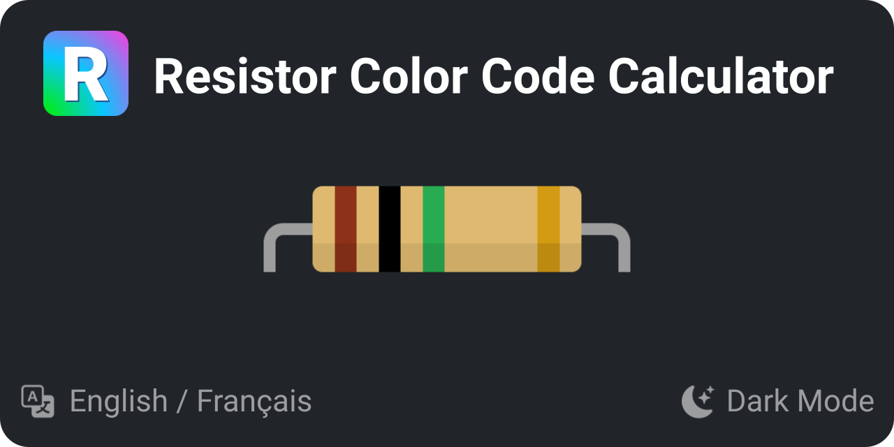

:toc: macro
:toc-title: Summary
:toclevels: 3
:numbered:

ifndef::env-github[:icons: font]
ifdef::env-github[]
:status:
:outfilesuffix: .adoc
:caution-caption: :fire:
:important-caption: :exclamation:
:note-caption: :paperclip:
:tip-caption: :bulb:
:warning-caption: :warning:
endif::[]

:back_to_top_target: top-target
:back_to_top_label: ⬆ Back to top
:back_to_top: <<{back_to_top_target},{back_to_top_label}>>

:main_title: Resistor Color Code Calculator
:git_project: resistor-color-code-calculator
:git_username: jprivet-dev
:git_url: https://github.com/{git_username}/{git_project}
:git_clone_ssh: git@github.com:{git_username}/{git_project}.git

// Releases
:project_release: v1.1.0
:angular_release: 16.1.8

[#{back_to_top_target}]
= {main_title}

image:https://badgen.net/badge/release/{project_release}/blue[Project release,link={git_url}/releases/tag/{project_release}]
image:https://badgen.net/badge/angular/{angular_release}/d93630[Angular release,link=https://github.com/angular/angular/releases/tag/{angular_release}]

toc::[]

== Presentation

Application for reading resistor color code values for a 3, 4, 5 or 6 band resistor, applying Ohm's law, calculating power, etc.

This application is a personal case study developed with https://angular.io/[Angular], https://ng-bootstrap.github.io/[NgBootstrap] and https://getbootstrap.com/[Bootstrap 5], and allows me to study https://ngrx.io/[NgRx] and https://redux.js.org/[Redux]. It also lets me try out http://localhost:4200/resistor-color-code-calculator/[Transloco], an Angular library dedicated to content translation.

{back_to_top}

== Installation

. `$ git clone {git_clone_ssh}`
. `$ cd {git_project}`
. `$ npm install`
. `$ make start`
. Open your browser on http://localhost:4200/resistor-color-code-calculator.

{back_to_top}

== Resources

* https://angular.io
* https://getbootstrap.com
* https://icons.getbootstrap.com
* https://ng-bootstrap.github.io
* https://ngrx.io
* https://ngneat.github.io/transloco
* https://github.com/angular-schule/angular-cli-ghpages
* https://favicon.io

{back_to_top}

== Comments, suggestions?

Feel free to make comments/suggestions to me in the {git_url}/issues[Git issues section].

{back_to_top}

== License

"{main_title}" is released under the {git_url}/blob/main/LICENSE[*MIT License*].

---

{back_to_top}
